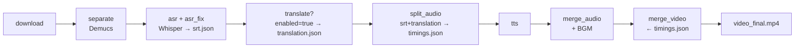
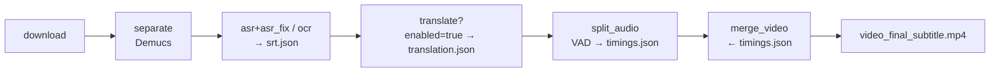

# Overview 重构方案

当前 Overview 的 mermaid + 文字 outdated，改为：
1. 节点说明表（各阶段简述 + I/O）
2. 两条完整流程（dub / subtitle）

---

## 节点说明

| 阶段 | 输入 | 输出 | 说明 |
|------|------|------|------|
| **download** | URL / 本地文件 | `video_source.mp4`, `ytdlp_info.json` | 下载/导入视频 |
| **separate** | `video_source.mp4` | `target_3_vocals.wav`, `target_bgm.wav` | Demucs 人声/BGM 分离 |
| **asr** | `target_3_vocals.wav` | `asr.json` | Whisper 语音转文字 |
| **asr_fix** | `asr.json` | `srt.json` | 时间戳 padding + 分段合并 |
| **ocr** | `video_source.mp4` | `srt.json` | RapidOCR 硬字幕提取（替代 asr+asr_fix） |
| **translate** | `srt.json` | `translation.json` | LLM 翻译。可跳过：`enabled: false` |
| **split_audio** | `srt.json` + `translation.json`(enabled) | `timings.json`, `segments/vocals/*.wav` | VAD 时间校正，统一写 `timings.json` |
| **tts** | `timings.json`, `segments/vocals/*.wav` | `segments/tts/*.wav` | 语音合成（dub only） |
| **merge_audio** | `timings.json`, `segments/tts/*.wav` | `audio_dubbing.wav` | 拼接 + 变速 + BGM 混音（dub only） |
| **merge_video** | `timings.json` + 音视频 | `video_final.mp4` / `video_final_subtitle.mp4` | 字幕烧录 + 最终合成 |

关键约定：
- **`timings.json`** 是下游唯一数据源（merge_video / merge_audio / tts 只读此文件）
- **`translation.json`** 仅作为 translate 的输出分界点，被 split_audio 消费后不再使用
- **`srt.json`** 是 ASR/OCR 统一输出格式，保持 source-agnostic

---

## 流程

### dub 模式

### subtitle 模式

特点：
- subtitle 模式去掉 ocr/separate 时不保留 separate（`subtitleSource: 'ocr'`）
- translate 跳过时 split_audio 从 srt.json 原文写 timings.json
- merge_video 只读 timings.json，不关心 translate 是否跑过

---

## 改动

替换 `architecture.md` 中 `## Overview` 到 `## Session Directory Layout` 之间的全部内容。
