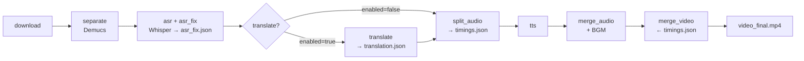
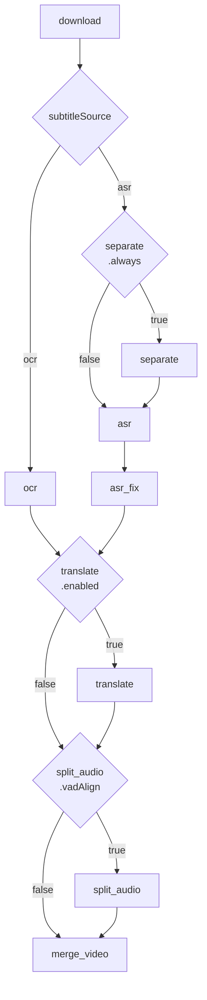

# Pipeline Architecture

```ts
export const DUB_STAGES: StageSpec[] = [
  { name: 'download', label: 'Download' },
  { name: 'separate', label: 'Demucs' },
  { name: 'asr', label: 'Whisper' },
  { name: 'asr_fix', label: 'Split sentences' },
  { name: 'translate', label: 'Translate' },
  { name: 'split_audio', label: 'Split audio' },
  { name: 'tts', label: 'VoxCPM' },
  { name: 'merge_audio', label: 'Merge audio' },
  { name: 'merge_video', label: 'Merge video' },
]

export const SUBTITLE_STAGES: StageSpec[] = [
  { name: 'download', label: 'Download' },
  { name: 'separate', label: 'Demucs' }, // 默认不是必须
  { name: 'asr', label: 'Whisper' },
  { name: 'asr_fix', label: 'Split sentences' },
  { name: 'translate', label: 'Translate' },
  { name: 'merge_video', label: 'Merge video' },
]
```

## Overview

### 节点说明

| 阶段 | 输入 | 输出 | 说明 |
|------|------|------|------|
| **download** | URL / 本地文件 | `video_source.mp4`, `ytdlp_info.json` | 下载/导入视频 |
| **separate** | `video_source.mp4` | `target_3_vocals.wav`, `target_bgm.wav` | Demucs 人声/BGM 分离 |
| **asr** | `target_3_vocals.wav` | `asr.json` | Whisper 语音转文字 |
| **asr_fix** | `asr.json` | `asr_fix.json` | 时间戳 padding + 分段合并 |
| **ocr** | `video_source.mp4` | `ocr.json` | RapidOCR 硬字幕提取（替代 asr+asr_fix） |
| **translate** | `asr_fix.json` / `ocr.json` | `translation.json` | LLM 翻译。可跳过：`enabled: false` |
| **split_audio** | `asr_fix.json` / `ocr.json` + `translation.json`(enabled) | `timings.json`, `segments/vocals/*.wav` | VAD 时间校正，统一写 `timings.json` |
| **tts** | `timings.json`, `segments/vocals/*.wav` | `segments/tts/*.wav` | 语音合成（dub only） |
| **merge_audio** | `timings.json`, `segments/tts/*.wav` | `audio_dubbing.wav` | 拼接 + 变速 + BGM 混音（dub only） |
| **merge_video** | `timings.json` + 音视频 | `video_final.mp4` / `video_final_subtitle.mp4` | 字幕烧录 + 最终合成 |

关键约定：
- **`timings.json`** 是下游唯一数据源（merge_video / merge_audio / tts 只读此文件）
- **`translation.json`** 仅作为 translate 的输出分界点，被 split_audio 消费后不再使用
- **`asr_fix.json` / `ocr.json`** — 字幕源文件，各自归属 asr_fix / ocr 阶段，下游通过 `subtitleSource` config 精准选择

### dub 流程



### subtitle 流程




## Session Directory Layout

```
<sessionPath>/                    # workfolder/<taskId> or workfolder/local/<taskId>
  ├── media/
  │   ├── video_source.mp4        # [download] original video
  │   ├── target_3_vocals.wav        # [separate] vocals stem (clean, Demucs output)
  │   ├── target_bgm.wav           # [separate] bgm stem (drums+bass+other)
  │   ├── video_final.mp4         # [merge_video] dub output
  │   └── video_final_subtitle.mp4# [merge_video] subtitle output
  ├── metadata/
  │   ├── local_info.json         # mode, languages, stage overrides
  │   ├── ytdlp_info.json         # [download] video metadata (yt-dlp --dump-json)
  │   ├── asr.json                # [asr] raw Whisper output (segments + words)
  │   ├── asr_fix.json          # [asr_fix] padded sentence timings
  │   ├── ocr.json           # [ocr] OCR subtitle recognition output
  │   ├── translation.<lang>.json # [translate] translated segments
  │   ├── timings.json            # [merge_audio] TTS segments with actual timings
  │   └── subtitles.<lang>.srt    # [merge_video] subtitle file (both modes)
  ├── tmp/
  │   ├── audio_source.wav        # [separate] WAV extracted from video (ffmpeg)
  │   ├── audio_dubbing.wav       # [merge_audio] concatenated TTS output
  │   ├── audio_mixed.m4a         # [merge_video] dubbing + BGM mixed
  │   ├── concat_list.txt         # [merge_audio] ffmpeg concat demuxer list
  │   └── silence_<N>.wav         # [merge_audio] gap filler silence
  └── segments/
      ├── vocals/<NNNN>.wav       # [split_audio] reference clips per segment
      ├── tts/<NNNN>.wav          # [tts] generated speech per segment
      └── stretched/<NNNN>.wav    # [merge_audio] tempo-adjusted TTS clips
```
- {NNNN}_trimmed.wav — TTS 原始输出 → silenceremove（去尾部静音）
- {NNNN}.wav — _trimmed → rubberband（变速拉伸至原视频对应句段时长）→ 最终拼入 audio_dubbing.wav
## Stage Inputs & Outputs

### download

From URL (yt-dlp) or local file (ffmpeg import).

| Input | Source | Description |
|---|---|---|
| `url` | task creation | YouTube/Bilibili URL or `local://upload/...` |
| `YOUTUBE_COOKIE_PATH` | config | Optional cookies file |

| Output | Destination | Description |
|---|---|---|
| `media/video_source.mp4` | ffmpeg/yt-dlp | Transcoded MP4 (H.264 + AAC) |
| `metadata/ytdlp_info.json` | yt-dlp `--dump-json` | Title, description, uploader, etc. |
| `metadata/local_info.json` | written by stage | Title, source, mode, languages |

---

### separate

Demucs vocal/instrumental separation. Same handler for both dub and subtitle modes (no special-casing).

| Input | Source | Description |
|---|---|---|
| `media/video_source.mp4` | download | Source video |
| config `separate.runtime` | `input.json` | `ort` or `pytorch` |
| config `separate.device` | `input.json` | `cpu`, `cuda`, or `webgpu` |

| Output | Destination | Description |
|---|---|---|
| `media/target_3_vocals.wav` | Demucs, `save_audio` | Clean vocals (44.1kHz mono WAV) |
| `media/target_bgm.wav` | Demucs, `save_audio` | BGM mix (drums+bass+other) |
| `tmp/audio_source.wav` | ffmpeg (ORT path) | Intermediate full-audio WAV |

---

### asr

Speech-to-text via Whisper (PyTorch) or faster-whisper (CTranslate2).

| Input | Source | Description |
|---|---|---|
| `media/target_3_vocals.wav` | separate | Clean vocals audio |
| `metadata/local_info.json` | download | `asr_language` (or "auto") |
| config `asr.runtime` | `input.json` | `pytorch` or (faster-whisper via `run.py`) |
| config `asr.device` | `input.json` | `cuda` or `cpu` |

| Output | Destination | Description |
|---|---|---|
| `metadata/asr.json` | Whisper / subprocess | JSON with `{ audio_info, result: { text, segments[] } }` |
| `metadata/local_info.json` | updated if detected | `asr_language` updated with detected language |

**asr.json structure:**
```json
{
  "audio_info": { "duration": <ms> },
  "result": {
    "text": "full transcript...",
    "segments": [
      { "text": "...", "start": <s>, "end": <s>, "words": [...] }
    ]
  }
}
```

Note: `duration` is in **milliseconds** (used for boundary clamping in audio slicing), while `segments[].start/end` are in **float seconds** (native Whisper output format).

---

### asr_fix

Refine ASR timings — pad short segments, merge adjacent same-speaker segments.

| Input | Source | Description |
|---|---|---|
| `metadata/asr.json` | asr | Raw Whisper output |

| Output | Destination | Description |
|---|---|---|
| `metadata/asr_fix.json` | written by stage | Same schema as `asr.json`, timings padded |

---

### translate

Translate ASR text via LLM (OpenAI-compatible API). 可跳过：`config.stages.translate.enabled = false` — 此时下游直接使用原文。

| Input | Source | Description |
|---|---|---|
| `metadata/asr_fix.json` / `ocr.json` | asr_fix / ocr | Sentences to translate（取决于 `subtitleSource`） |
| `metadata/ytdlp_info.json` | download | Optional context (title, description) |
| `metadata/local_info.json` | download | Language settings |
| config `translate.apiBase` | `input.json` | LLM API endpoint |
| config `translate.model` | `input.json` | LLM model name |

| Output | Destination | Description |
|---|---|---|
| `metadata/translation.<lang>.json` | LLM response | Translated segments |
| `metadata/local_info.json` | updated if override | `target_language` may be overwritten |

**translation.json structure:**
```json
{
  "translation": [
    { "src": "original", "dst": "translated", "src_lang": "en", "dst_lang": "zh",
      "start_time": <ms>, "end_time": <ms>, "speaker": "" }
  ]
}
```

---

### split_audio

Slice vocals WAV into per-segment reference clips using translation timings.
- subtitle 模式下仅在 `vadAlign: true` 时运行，否则 merge_video 直接读 `asr_fix.json` / `ocr.json`。
- translate 跳过时从字幕源文件取原文作为 `src`/`dst`。

| Input | Source | Description |
|---|---|---|
| `media/target_3_vocals.wav` | separate | Full vocals audio |
| `metadata/translation.<lang>.json` | translate | Segment boundaries (enabled=true 时必需) |
| `metadata/local_info.json` | download | Target language code |

| Output | Destination | Description |
|---|---|---|
| `segments/vocals/<NNNN>.wav` | ffmpeg `-ss -to -c copy` | Per-segment WAV clips (44 bytes for empty) |
| `metadata/timings.json` | written by stage | Segment timings with src/dst text |
| (dir cleared on re-run) | | If translation file is newer than existing clips |

---

### tts (dub only)

Voice cloning TTS via VoxCPM2 (ONNX / PyTorch / Cloud).

| Input | Source | Description |
|---|---|---|
| `metadata/translation.<lang>.json` | translate | Target text per segment |
| `segments/vocals/<NNNN>.wav` | split_audio | Reference audio for voice cloning |
| config `tts.runtime` | `input.json` | `ort`, `pytorch`, or `cloud` |
| config `tts.device` | `input.json` | `cpu`, `webgpu`, or `cuda` |

| Output | Destination | Description |
|---|---|---|
| `segments/tts/<NNNN>.wav` | VoxCPM inference | Generated speech (48kHz mono WAV, 44 bytes for empty) |
| (dir cleared on re-run) | | If translation file is newer than existing TTS |

---

### merge_audio (dub only)

Concatenate TTS segments into a continuous dubbing track with tempo adjustment and gap-fill silence.

| Input | Source | Description |
|---|---|---|
| `metadata/translation.<lang>.json` | translate | Expected segment timings |
| `segments/tts/<NNNN>.wav` | tts | Generated speech per segment |

| Output | Destination | Description |
|---|---|---|
| `tmp/audio_dubbing.wav` | ffmpeg concat | Final dubbing audio track |
| `metadata/timings.json` | written by stage | Updated timings with `actual_start/end_time` |
| `segments/stretched/<NNNN>.wav` | ffmpeg atempo | Tempo-adjusted clips |
| `tmp/silence_<N>.wav` | ffmpeg `anullsrc` | Gap-filler silence |

**timings.json structure:**
```json
{
  "translation": [
    { "src": "..", "dst": "..", "start_time": <ms>, "end_time": <ms>,
      "actual_start_time": <ms>, "actual_end_time": <ms> }
  ]
}
```

---

### merge_video

Combine audio + video + optional subtitles. Different output per mode:

| Mode | Inputs | Output |
|---|---|---|
| **dub** | `video_source.mp4` + `audio_dubbing.wav` + `target_bgm.wav` + `timings.json` | `media/video_final.mp4` (dubbed audio + subtitles + BGM) |
| **subtitle** | `video_source.mp4` + `timings.json` | `media/video_final_subtitle.mp4` (burned-in subtitles) |

Both modes produce an SRT subtitle file at `metadata/subtitles.<lang>.srt`.

| Output | Destination | Description |
|---|---|---|
| `media/video_final.mp4` | ffmpeg (dub) | H.264 video + dubbed audio + subtitles |
| `media/video_final_subtitle.mp4` | ffmpeg (subtitle) | H.264 video + original audio + burned subs |
| `metadata/subtitles.<lang>.srt` | written by stage | Subtitle file (both modes) |
| `tmp/audio_mixed.m4a` | ffmpeg amix (dub) | Vocals (1.0) + BGM (0.30) mix |

---

## DB Schema

### `tasks` table

| Column | Type | Description | Set by |
|---|---|---|---|
| `id` | text PK | Task identifier | creation |
| `url` | text NOT NULL | Source URL | creation |
| `title` | text? | Video title | download |
| `status` | text NOT NULL | pending/running/succeeded/failed | pipeline |
| `current_stage` | text? | Currently executing stage | pipeline |
| `task_dir` | text? | Relative path to session dir | download |
| `final_video_path` | text? | API path to output video | merge_video |
| `error_message` | text? | Failure reason | pipeline |
| `created_at` | text NOT NULL | ISO timestamp | creation |
| `started_at` | text? | ISO timestamp | pipeline |
| `completed_at` | text? | ISO timestamp | pipeline |

### `task_stages` table

Composite PK: `(task_id, name)`, FK → `tasks.id ON DELETE CASCADE`.

| Column | Type | Description |
|---|---|---|
| `task_id` | text NOT NULL | FK → tasks |
| `name` | text NOT NULL | Stage name |
| `label` | text NOT NULL | Display label |
| `status` | text NOT NULL | pending/running/succeeded/failed |
| `started_at` | text? | ISO timestamp |
| `completed_at` | text? | ISO timestamp |
| `last_message` | text? | Human-readable status |
| `error_message` | text? | Failure details |
| `progress` | integer? | 0–100 |

## Mode Differences

| Stage | Dub | Subtitle |
|---|---|---|
| separate | Demucs (vocals + bgm) | Demucs (vocals + bgm, same handler) |
| split_audio | ✅ YES | ✅ only if `vadAlign: true` |
| tts | ✅ YES | ❌ skipped |
| merge_audio | ✅ YES | ❌ skipped |
| merge_video | dubbing + BGM + subs | burned-in subtitles only |

## Stage Names

| Stage | `name` in DB | Subtitle? | Dub? |
|---|---|---|---|
| Download | `download` | ✅ | ✅ |
| Demucs | `separate` | ✅ | ✅ |
| ASR | `asr` | ✅ | ✅ |
| Fix timings | `asr_fix` | ✅ | ✅ |
| Translate | `translate` | ✅ (可跳过 via `enabled: false`) | ✅ (ditto) |
| Split audio | `split_audio` | — | ✅ |
| TTS | `tts` | — | ✅ |
| Merge audio | `merge_audio` | — | ✅ |
| Merge video | `merge_video` | ✅ | ✅ |
